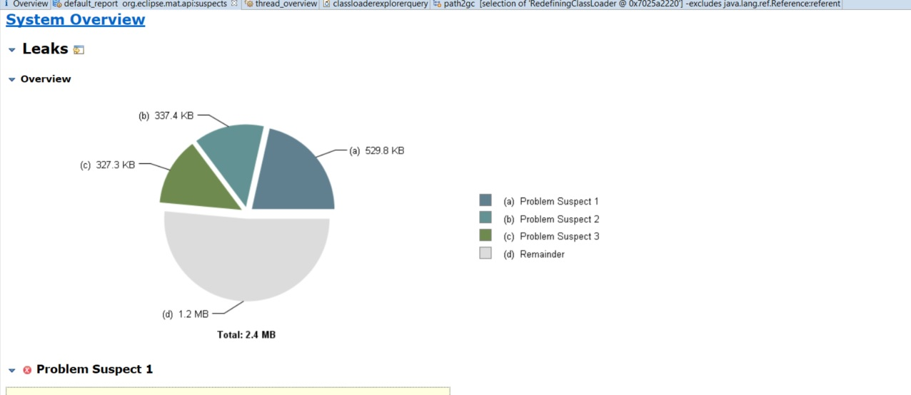
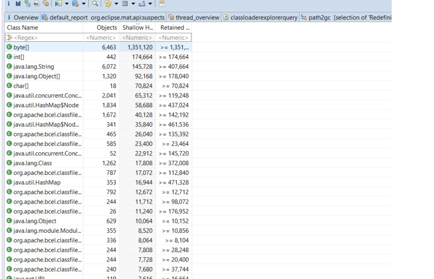
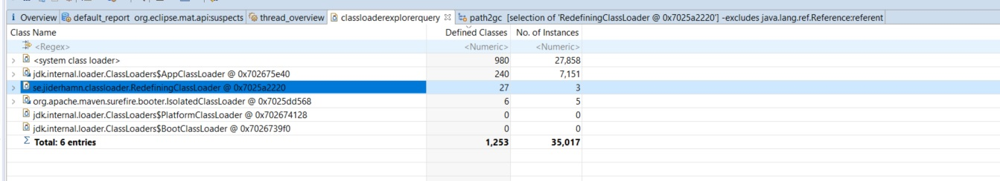
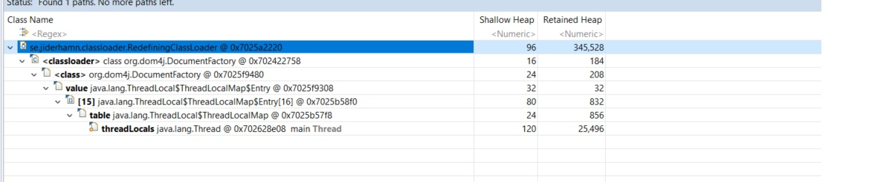

### Classloader Leak
This time i want to introduce very elegant classloader test api and classloader leak prevention api. We can check our thirdparty libraries classloader leaks, using these test apis. Some thirdparty libraries are vital for our projects and we can not upgrae them easily. ClassLoaderPrevention api will detect and clean unused classloaders on runtime. 

1. Run Classloader Leak TestCases
```bash
mvn clean package
```
Open new terminal and dump jvm process

```bash
jmap -dump:live,format=b,file=/home/pamir/dev/tools_data/dumps/classloaderleak.hprof 38132

```

```
-------------------------------------------------------
 T E S T S
-------------------------------------------------------
Running com.pamir.cases.ClassloaderLeakTest
Loading com.pamir.cases.ClassloaderLeakTest in se.jiderhamn.classloader.RedefiningClassLoader[com.pamir.cases.ClassloaderLeakTest.testRun]@1a8a8f7c
Loading se.jiderhamn.classloader.leak.Leaks in se.jiderhamn.classloader.RedefiningClassLoader[com.pamir.cases.ClassloaderLeakTest.testRun]@1a8a8f7c
JUnit used jdk.internal.loader.ClassLoaders$AppClassLoader@2cdf8d8a
SeparateClassLoaderInvokeMethod used se.jiderhamn.classloader.RedefiningClassLoader[com.pamir.cases.ClassloaderLeakTest.testRun]@1a8a8f7c
38132
Loading org.dom4j.DocumentHelper in se.jiderhamn.classloader.RedefiningClassLoader[com.pamir.cases.ClassloaderLeakTest.testRun]@1a8a8f7c
Loading org.dom4j.Branch in se.jiderhamn.classloader.RedefiningClassLoader[com.pamir.cases.ClassloaderLeakTest.testRun]@1a8a8f7c
Loading org.dom4j.Node in se.jiderhamn.classloader.RedefiningClassLoader[com.pamir.cases.ClassloaderLeakTest.testRun]@1a8a8f7c
Loading org.dom4j.DocumentFactory in se.jiderhamn.classloader.RedefiningClassLoader[com.pamir.cases.ClassloaderLeakTest.testRun]@1a8a8f7c
Loading org.dom4j.NodeFilter in se.jiderhamn.classloader.RedefiningClassLoader[com.pamir.cases.ClassloaderLeakTest.testRun]@1a8a8f7c
Loading org.dom4j.Element in se.jiderhamn.classloader.RedefiningClassLoader[com.pamir.cases.ClassloaderLeakTest.testRun]@1a8a8f7c
Loading org.dom4j.XPath in se.jiderhamn.classloader.RedefiningClassLoader[com.pamir.cases.ClassloaderLeakTest.testRun]@1a8a8f7c
Loading org.dom4j.rule.Pattern in se.jiderhamn.classloader.RedefiningClassLoader[com.pamir.cases.ClassloaderLeakTest.testRun]@1a8a8f7c
Loading org.dom4j.Entity in se.jiderhamn.classloader.RedefiningClassLoader[com.pamir.cases.ClassloaderLeakTest.testRun]@1a8a8f7c
Loading org.dom4j.Text in se.jiderhamn.classloader.RedefiningClassLoader[com.pamir.cases.ClassloaderLeakTest.testRun]@1a8a8f7c
Loading org.dom4j.CharacterData in se.jiderhamn.classloader.RedefiningClassLoader[com.pamir.cases.ClassloaderLeakTest.testRun]@1a8a8f7c
Loading org.dom4j.Comment in se.jiderhamn.classloader.RedefiningClassLoader[com.pamir.cases.ClassloaderLeakTest.testRun]@1a8a8f7c
Loading org.dom4j.CDATA in se.jiderhamn.classloader.RedefiningClassLoader[com.pamir.cases.ClassloaderLeakTest.testRun]@1a8a8f7c
Loading org.dom4j.DocumentType in se.jiderhamn.classloader.RedefiningClassLoader[com.pamir.cases.ClassloaderLeakTest.testRun]@1a8a8f7c
Loading org.dom4j.ProcessingInstruction in se.jiderhamn.classloader.RedefiningClassLoader[com.pamir.cases.ClassloaderLeakTest.testRun]@1a8a8f7c
Loading org.dom4j.Attribute in se.jiderhamn.classloader.RedefiningClassLoader[com.pamir.cases.ClassloaderLeakTest.testRun]@1a8a8f7c
Loading org.dom4j.Document in se.jiderhamn.classloader.RedefiningClassLoader[com.pamir.cases.ClassloaderLeakTest.testRun]@1a8a8f7c
Loading org.dom4j.tree.QNameCache in se.jiderhamn.classloader.RedefiningClassLoader[com.pamir.cases.ClassloaderLeakTest.testRun]@1a8a8f7c
#Test will wait 10 seconds. Dump memory. It will print process id on the console
jmap -dump:live,format=b,file=/home/pamir/dev/tools_data/dumps/classloaderleak.hprof 38132
```


2. Open memory dump file with Memory Analyzer Tool


3. Open Mat and Look Default Overview Page </p>

4. Open Histogram </p>


5. Open Classloader Explorer </p>

6. Click Classloader for outgoing references and expand it. </p>


### References
- https://www.jrebel.com/blog/how-do-classloader-leaks-happen
- https://github.com/mjiderhamn/classloader-leak-prevention
- [JDK IO 2016 - Mattias Jiderhamn - Join my war on ClassLoader leaks]( https://www.youtube.com/watch?v=dXqIfo5h2BE)
