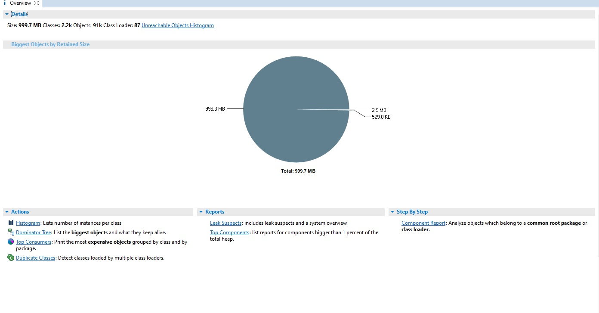

```bash
docker run -it --rm  -e JVM_ARGS="-Xmx1024M -Xms1024m -XX:+HeapDumpOnOutOfMemoryError -XX:HeapDumpPath=/my-fault/NonFinalized.hprof" pamir/jvm-cases NonFinalized
```

```
finalize method called
finalize method called
finalize method called
finalize method called
finalize method called
finalize method called
finalize method called
java.lang.OutOfMemoryError: Java heap space
Dumping heap to /my-fault/NonFinalized.hprof ...
Heap dump file created [1052655543 bytes in 2.251 secs]
```

```
#Container crash
docker ps -a
docker cp 02d4fc404f1e:/my-fault/NonFinalized.hprof NonFinalized.hprof
```

 Open Mat and Look Default Overview Page </p>
 </p>


Open Histogram Page </p>

 </p>

Select  byte arrays you suspect, and right click, select outgoing references


