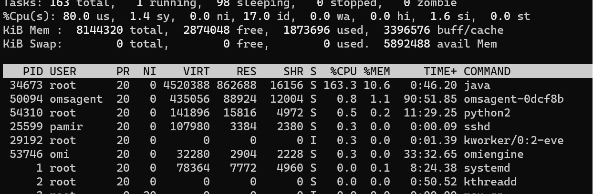
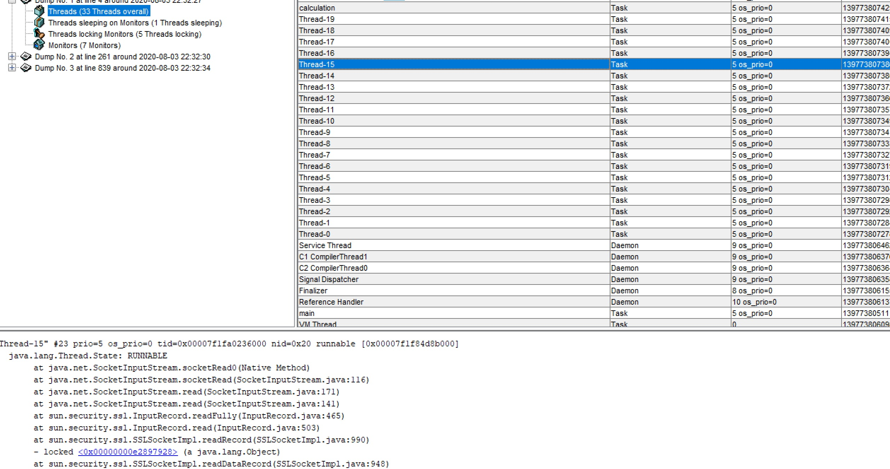
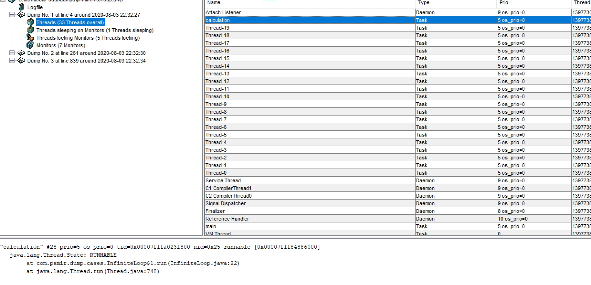

### High CPU Hang
Our dockerized Java application hangs and we don't know why. We know, that process is idle(CPU usage near 100% for one of threads).

1. Run Test App
```bash
docker run -it --rm  pamir/jvm-cases InfiniteLoop
```

2. Check, that our app is idle(%CPU=~0.0):
```bash
top -c -p $(pgrep -d',' -f java)
```

#### Steps To Analyze

1. Get id of container with our application(java application.jar ...):

```bash
docker ps
```

2. Run container with jattach utility:
```bash
docker run --rm -it \
	--net=container:02d4fc404f1e \
	--pid=container:02d4fc404f1e \
	-v /tmp:/tmp \
   --privileged \
	adriantodt/alpine-zlib-jattach \
	/bin/sh
```

where 741d07985f66 is id of container with our application.

Find PID of dotnet process we need to analyze(java application.jar ...):
```bash
ps aux
```



In this example PID is "1"

4. Dump call stack of java  process with kill -3:
```bash
kill -3 1
sleep 3

kill -3 1
sleep 3
kill -3 1
```

5.  Print All Threads
```
"Thread-3" #11 prio=5 os_prio=0 tid=0x00007f1fa0220800 nid=0x14 waiting on condition [0x00007f1f85997000]
   java.lang.Thread.State: TIMED_WAITING (sleeping)
        at java.lang.Thread.sleep(Native Method)
        at com.pamir.dump.cases.utils.ThreadUtils.sleepUninterruptedly(ThreadUtils.java:7)
        at com.pamir.dump.cases.utils.BusyIOUtils$1.run(BusyIOUtils.java:23)
        at java.lang.Thread.run(Thread.java:748)

"Thread-2" #10 prio=5 os_prio=0 tid=0x00007f1fa021f000 nid=0x13 waiting on condition [0x00007f1f85a98000]
   java.lang.Thread.State: TIMED_WAITING (sleeping)
        at java.lang.Thread.sleep(Native Method)
        at com.pamir.dump.cases.utils.ThreadUtils.sleepUninterruptedly(ThreadUtils.java:7)
        at com.pamir.dump.cases.utils.BusyIOUtils$1.run(BusyIOUtils.java:23)
        at java.lang.Thread.run(Thread.java:748)

"Thread-1" #9 prio=5 os_prio=0 tid=0x00007f1fa021d000 nid=0x12 runnable [0x00007f1f85b98000]
   java.lang.Thread.State: RUNNABLE
        at java.security.Provider$ServiceKey.hashCode(Provider.java:876)
        at java.util.HashMap.hash(HashMap.java:339)
        at java.util.LinkedHashMap.get(LinkedHashMap.java:440)
        at java.security.Provider.getService(Provider.java:1049)
        - locked <0x0000000083a46c10> (a com.sun.net.ssl.internal.ssl.Provider)
        at sun.security.jca.ProviderList$ServiceList.tryGet(ProviderList.java:437)
        at sun.security.jca.ProviderList$ServiceList.access$200(ProviderList.java:376)
        at sun.security.jca.ProviderList$ServiceList$1.hasNext(ProviderList.java:486)
        at javax.crypto.KeyGenerator.nextSpi(KeyGenerator.java:338)
        - locked <0x00000000d8c5be68> (a java.lang.Object)
        at javax.crypto.KeyGenerator.<init>(KeyGenerator.java:168)
        at javax.crypto.KeyGenerator.getInstance(KeyGenerator.java:223)
        at sun.security.ssl.JsseJce.getKeyGenerator(JsseJce.java:251)
        at sun.security.ssl.HandshakeMessage$Finished.getFinished(HandshakeMessage.java:1986)
        at sun.security.ssl.HandshakeMessage$Finished.<init>(HandshakeMessage.java:1903)
        at sun.security.ssl.ClientHandshaker.sendChangeCipherAndFinish(ClientHandshaker.java:1315)
        at sun.security.ssl.ClientHandshaker.serverHelloDone(ClientHandshaker.java:1233)
        at sun.security.ssl.ClientHandshaker.processMessage(ClientHandshaker.java:372)
        at sun.security.ssl.Handshaker.processLoop(Handshaker.java:1082)
        at sun.security.ssl.Handshaker.process_record(Handshaker.java:1010)
        at sun.security.ssl.SSLSocketImpl.readRecord(SSLSocketImpl.java:1079)
        - locked <0x00000000d8aad620> (a sun.security.ssl.SSLSocketImpl)
        - locked <0x00000000d8aad818> (a java.lang.Object)
        at sun.security.ssl.SSLSocketImpl.performInitialHandshake(SSLSocketImpl.java:1388)
        - locked <0x00000000d8aad7d8> (a java.lang.Object)
        at sun.security.ssl.SSLSocketImpl.startHandshake(SSLSocketImpl.java:1416)
        at sun.security.ssl.SSLSocketImpl.startHandshake(SSLSocketImpl.java:1400)
        at org.apache.http.conn.ssl.SSLConnectionSocketFactory.createLayeredSocket(SSLConnectionSocketFactory.java:436)
        at org.apache.http.conn.ssl.SSLConnectionSocketFactory.connectSocket(SSLConnectionSocketFactory.java:384)
        at org.apache.http.impl.conn.DefaultHttpClientConnectionOperator.connect(DefaultHttpClientConnectionOperator.java:142)
        at org.apache.http.impl.conn.PoolingHttpClientConnectionManager.connect(PoolingHttpClientConnectionManager.java:376)
        at org.apache.http.impl.execchain.MainClientExec.establishRoute(MainClientExec.java:393)
        at org.apache.http.impl.execchain.MainClientExec.execute(MainClientExec.java:236)
        at org.apache.http.impl.execchain.ProtocolExec.execute(ProtocolExec.java:186)
        at org.apache.http.impl.execchain.RetryExec.execute(RetryExec.java:89)
        at org.apache.http.impl.execchain.RedirectExec.execute(RedirectExec.java:110)
        at org.apache.http.impl.client.InternalHttpClient.doExecute(InternalHttpClient.java:185)
        at org.apache.http.impl.client.CloseableHttpClient.execute(CloseableHttpClient.java:83)
        at org.apache.http.impl.client.CloseableHttpClient.execute(CloseableHttpClient.java:108)
        at com.pamir.dump.cases.utils.WebPageLoader.load(WebPageLoader.java:22)
        at com.pamir.dump.cases.utils.BusyIOUtils$1.run(BusyIOUtils.java:19)
        at java.lang.Thread.run(Thread.java:748)

"Thread-0" #8 prio=5 os_prio=0 tid=0x00007f1fa021b800 nid=0x11 waiting on condition [0x00007f1f85c9a000]
   java.lang.Thread.State: TIMED_WAITING (sleeping)
        at java.lang.Thread.sleep(Native Method)
        at com.pamir.dump.cases.utils.ThreadUtils.sleepUninterruptedly(ThreadUtils.java:7)
        at com.pamir.dump.cases.utils.BusyIOUtils$1.run(BusyIOUtils.java:23)
        at java.lang.Thread.run(Thread.java:748)

"Service Thread" #7 daemon prio=9 os_prio=0 tid=0x00007f1fa0154800 nid=0xf runnable [0x0000000000000000]
   java.lang.Thread.State: RUNNABLE
```

6. Extract the CPU Bound Threads. The long running CPU Bound threads method call is "com.pamir.dump.cases.InfiniteLoop$1.run(InfiniteLoop.java:22)"
For TLS connection; TLS handshake spikes CPU as well.

```
"calculation" #28 prio=5 os_prio=0 tid=0x00007f1fa023f800 nid=0x25 runnable [0x00007f1f84886000]
   java.lang.Thread.State: RUNNABLE
        at com.pamir.dump.cases.InfiniteLoop$1.run(InfiniteLoop.java:22)
        at java.lang.Thread.run(Thread.java:748)

"Thread-1" #9 prio=5 os_prio=0 tid=0x00007f1fa021d000 nid=0x12 runnable [0x00007f1f85b98000]
   java.lang.Thread.State: RUNNABLE
        at java.security.Provider$ServiceKey.hashCode(Provider.java:876)
        at java.util.HashMap.hash(HashMap.java:339)
        at java.util.LinkedHashMap.get(LinkedHashMap.java:440)
        at java.security.Provider.getService(Provider.java:1049)
```

7. Another way
```bash
jattach 1 threaddump >> /tmp/threads.dmp
jattach 1 threaddump >> /tmp/threads.dmp
jattach 1 threaddump >> /tmp/threads.dmp
```
8. Download Thread Dump Analyzer from https://mkbrv.github.io/tda/
9. Open /tmp/threads.dmp with thread dump analyzer


10. Find the Cpu Bound Thread


### TODO
- Drop unnecessary capabilities. Use --add-cap instead of --privieged