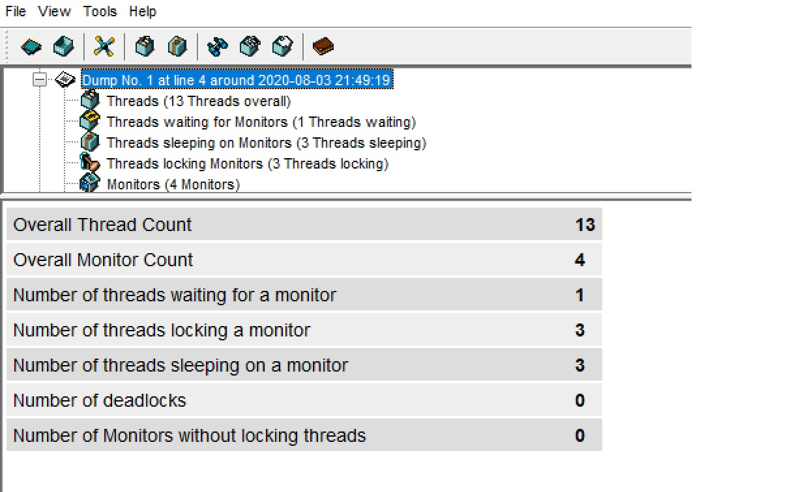
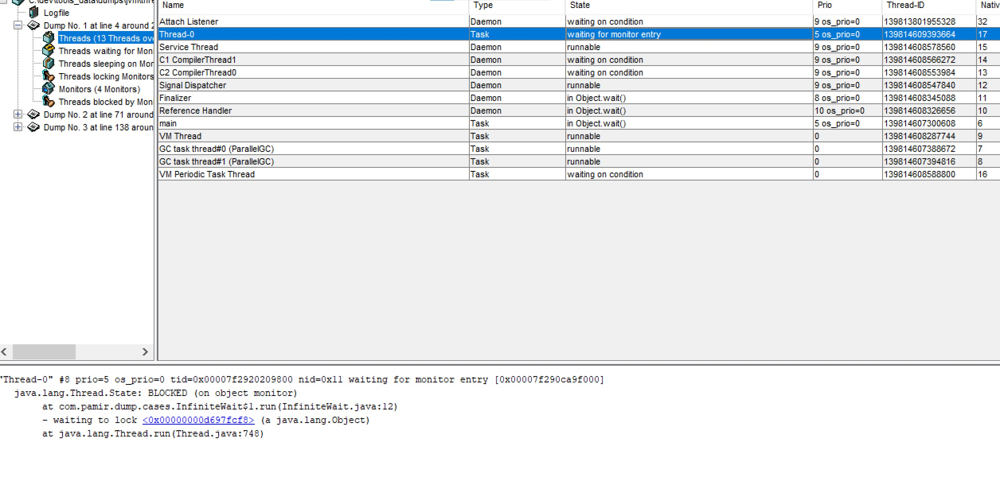

### Low CPU Hang
Our dockerized Java application hangs and we don't know why. We know, that process is idle(CPU usage near 0%).

1. Run Test App
```bash
docker run -it --rm  pamir/jvm-cases InfiniteWait
```

2. Check, that our app is idle(%CPU=~0.0):
```bash
top -c -p $(pgrep -d',' -f java)
```

#### Steps To Analyze

1. Get id of container with our application(java application.jar ...):

```bash
docker ps
```

2. Run container with jattach utility:
```bash
docker run --rm -it \
	--net=container:741d07985f66 \
	--pid=container:741d07985f66 \
	-v /tmp:/tmp \
        --privileged \
	adriantodt/alpine-zlib-jattach \
	/bin/sh
```

where 741d07985f66 is id of container with our application.

Find PID of dotnet process we need to analyze(java application.jar ...):
```bash
ps aux
```

In this example PID is "1"

4. Dump call stack of java  process with kill -3:
```bash
kill -3 1
sleep 3

kill -3 1
sleep 3
kill -3 1
```

5.  Print the main thread
```
"main" #1 prio=5 os_prio=0 tid=0x00007f292000a800 nid=0x6 in Object.wait() [0x00007f292a12b000]
   java.lang.Thread.State: WAITING (on object monitor)
        at java.lang.Object.wait(Native Method)
        - waiting on <0x00000000d697fe88> (a java.lang.Thread)
        at java.lang.Thread.join(Thread.java:1252)
        - locked <0x00000000d697fe88> (a java.lang.Thread)
        at java.lang.Thread.join(Thread.java:1326)
        at com.pamir.dump.cases.InfiniteWait.runInternal(InfiniteWait.java:17)
        - locked <0x00000000d697fcf8> (a java.lang.Object)
        at com.pamir.dump.cases.InfiniteWait.run(InfiniteWait.java:23)
        at com.pamir.dump.cases.Application.main(Application.java:24)
```

6. Print the Blocked Thread

```
"Thread-0" #8 prio=5 os_prio=0 tid=0x00007f2920209800 nid=0x11 waiting for monitor entry [0x00007f290ca9f000]
   java.lang.Thread.State: BLOCKED (on object monitor)
        at com.pamir.dump.cases.InfiniteWait$1.run(InfiniteWait.java:12)
        - waiting to lock <0x00000000d697fcf8> (a java.lang.Object)
        at java.lang.Thread.run(Thread.java:748)
```

7. Another way
```bash
jattach 1 threaddump >> /tmp/threads.dmp
jattach 1 threaddump >> /tmp/threads.dmp
jattach 1 threaddump >> /tmp/threads.dmp
```
8. Download Thread Dump Analyzer from https://mkbrv.github.io/tda/
9. Open /tmp/threads.dmp with thread dump analyzer


10. Find the blocking thread


### TODO
- Drop unnecessary capabilities. Use --add-cap instead of --privieged
