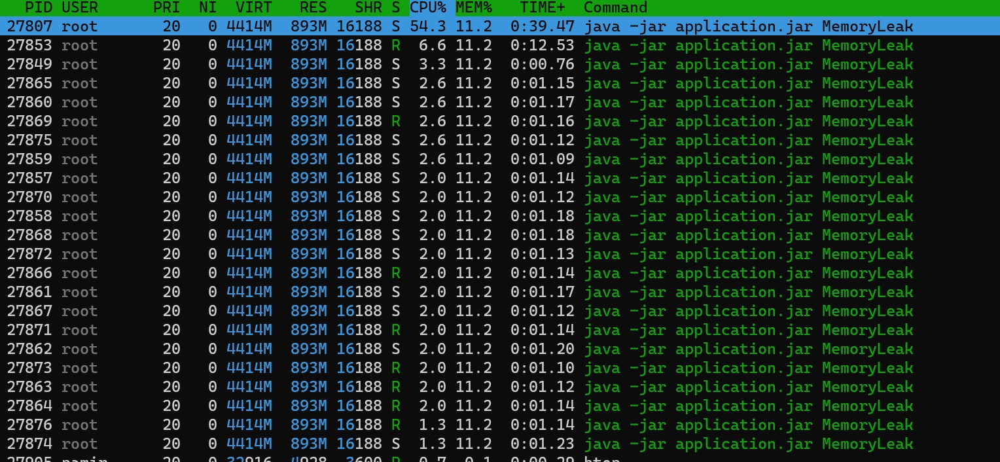
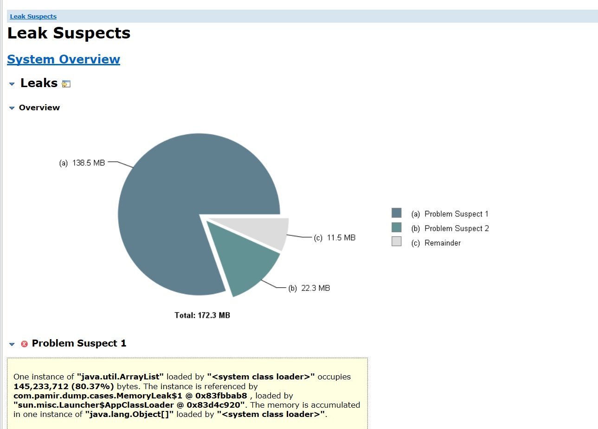
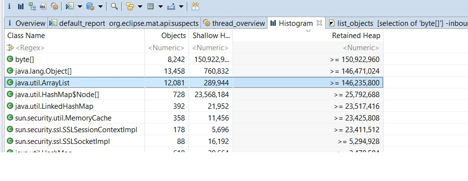
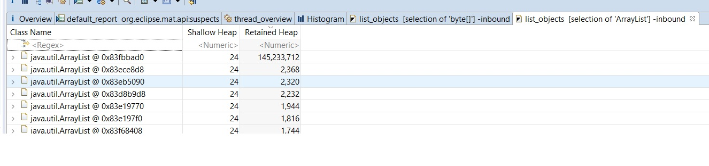
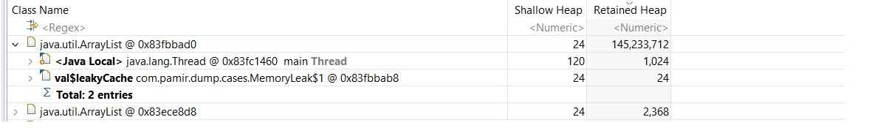

### MemoryLeak
Our dockerized Java application memory usage increases minute to minute. 
See %MEM and RES and Virt Memory smooth increase   


1. Run Test App
```bash
docker run -it --rm  pamir/jvm-cases MemoryLeak
```



2. Check, that our app is idle(%CPU=~0.0):
```bash
top -c -p $(pgrep -d',' -f java)
```

#### Steps To Analyze

1. Get id of container with our application(java application.jar ...):

```bash
docker ps
```

2. Run container with jattach utility:
```bash
docker run --rm -it \
	--net=container:8b0970e1aa99 \
	--pid=container:8b0970e1aa99 \
	-v /tmp:/tmp \
	--privileged \
	adriantodt/alpine-zlib-jattach \
	/bin/sh
```

3. Dump Heap with jattach
 
```bash
jattach 1 heapdump /tmp/memoryleak1.hprof
jattacj 1 heapdump /tmp/memoryleak2.hprof
```

4. Be careful the dump  files are not in in on jattach container. They are on java container's tmp directory
```bash
ls -lart /tmp
```

5. Copy Dump files from java container to host machine
```bash
docker cp 8b0970e1aa99:/tmp/memoryleak1.hprof /tmp/memoryleak1.hprof
docker cp 8b0970e1aa99:/tmp/memoryleak2.hprof /tmp/memoryleak2.hprof
```

6. Download Memory Dump Analzyer Tool</p>
http://www.eclipse.org/mat/

7. Open memoryleak1.hprof Dump File and see leak suspect report</p>


9. Open Histogram and sort by retained heap size</p>


10. Go to incoming References and sort by Retained Heap Size </p>


11. Expand the top level Arraylist and see what is holding it  </p>



### Todo
- drop capabilities
- Add Reference to Charlie Hunt Book Java Performance
- Refer to Source Code